```{r setup, include=FALSE}
options(htmltools.dir.version = FALSE)
knitr::opts_chunk$set(
	echo = TRUE,
	fig.height = 3.5,
	fig.retina = 3,
	fig.width = 9,
	message = FALSE,
	warning = FALSE,
	cache = FALSE,
	hiline = TRUE,
	out.width = "100%"
)
```

```{r xaringan-themer, include=FALSE, warning=FALSE}
library(xaringanthemer)
style_mono_light(
  header_font_google = google_font("Roboto Condensed"),
  text_font_google = google_font("Noto Serif")
)
```

```{r include=FALSE, warning=FALSE}
library(languageR)
library(stylo)
library(tidyverse)
library(dendextend)
library(ape)
library(pals)
library(stopwords)
library(widyr)
library(tidyr)
library(furrr)
library(tidytext)
library(reshape2)
library(tm)
library(topicmodels)
```

```{r xaringanExtra, echo=FALSE}
    xaringanExtra::use_logo(
      image_url = "images/hse.png",
      width = "73px",
      height = "73px",
    )
```

---

## Количественные методы и история философии

1. Меры лексического разнообразия: Л. Кэмпбелл и начала стилометрии

2. Наиболее частотные слова: Ф. Бласс и В. Диттенбергер

3. На пути к многомерному анализу: В. Лютославский и Г. Леджер

4. Автоматическая классификация текстов: эксперимент

5. Сравнения слов: векторная семантика

6. Тематическое моделирование


---
class: animated, fadeIn
## 1. Л. Кэмпбелл и начала стилометрии 
.pull-left[

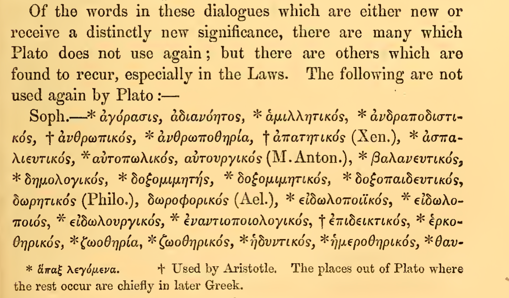
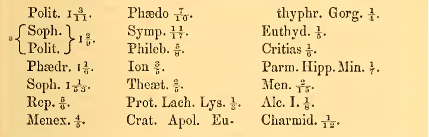

]
--
.pull-right[
- Льюис Кэмпбелл, профессор Сент-Эндрюсского университета в Шотландии; в 1867 году  впервые применил количественный метод для датировки  диалогов Платона;

- опираясь на Lexicon Platonicum Ф. Аста, Кэмпбелл установил, что в «Тимее» и «Критии» содержится в общей сложности 427 гапаксов, а в «Законах» — 1065 слов (всего 1492);

- он также составил список слов, которые встречаются несколько раз, но лишь в предположительно поздней группе, и подсчитал количество слов (на страницу), объединяющих каждый из 24 диалогов с «Тимеем», «Критием» и «Законами»
]


---
# 1. Пересчитывая Кэмпбелла

```{r echo=FALSE, eval=FALSE}
# my_corpus = load.corpus.and.parse(files = "all", corpus.dir = "Campbell_26", corpus.lang = "Other")
# corp_freq <- make.frequency.list(my_corpus, value = TRUE, relative = F)
# hapax_names <- names(corp_freq[corp_freq==1])
# 
# corpus_size <- length(my_corpus)
# corpus_names <- names(my_corpus)
# 
# d <- data.frame()
# for (i in 1:corpus_size){
#     
#      my_text<- my_corpus[[i]]
#      my_vec <- logical()
#      
#      for (z in my_text) {
#          x <- any(hapax_names == z)  
#          my_vec <- c(my_vec, x)
#      }
#      hapax_sum <- sum(my_vec)
#      text_size <- length(my_text)
#      
#      result <-(c(corpus_names[i], text_size, hapax_sum, round((hapax_sum/text_size), digits = 3)))
#      
#      d <- rbind(d, result)
# }
# names(d) <- c("D", "W", "H", "H/W")
# d <- d[order(d$`H/W`, decreasing = F),]
# save(d, file="D.Rdata")
```

```{r echo=F}
load("data/D.Rdata")
DT::datatable(d, fillContainer = FALSE, options = list(pageLength = 6))
```

---
# 1. Кое-что о гапаксах


```{r include=FALSE, eval=FALSE}
## load text
# Laws <- load.corpus.and.parse(file = "Laws.txt", corpus.dir = getwd(), markup.type= "plain", corpus.lang = "Other", sampling = "no.sampling", encoding = "UTF-8")
# ## analyze growth rate
# laws.growth <- growth.fnc(text = Laws[[1]], size = 3000, nchunks = 10)
# laws.g <- laws.growth@data$data
# save(laws.g, file="LawsG.Rdata")
```

```{r echo=FALSE, message=FALSE}
load("data/LawsG.Rdata")
knitr::kable(head(laws.g[1:10, 1:6]), format = 'html')
```


О распределениях слов см.: 
- R.H. Baayen. Analyzing Linguistic Data. 8th ed. Cambridge, 2015.
- R.H. Baayen. Word Frequency Distributions. Dordrecht, 2001.

---
# 1. Type-token ratio: "Законы" Платона
```{r include=FALSE, eval=FALSE}
## let us take 50  normal 5000-word samples from the Laws
# my_samples <- make.samples(Laws[[1]], sample.size = 5000, sampling = "normal.sampling")
# ## we know the number of tokens in each sample, so what we need is a number of types 
# ttr <- c()
# tokens = 5000
# for(i in 1:length(my_samples)){
#   types <- length(table(my_samples[[i]]))
#   tt <- types/tokens
#   ttr <- c(ttr, tt)
# }
# ttr <- as_tibble(ttr) %>% rename(ttr = value)
# ## general ttr 
# ttr.gen <- as_tibble((round((length(table(Laws[[1]])) / length(Laws[[1]])), 3)))
# tbl <- ttr %>% bind_cols(ttr.gen) %>% rename(ttr.gen = value)
# ## ttr from growth object
# laws.growth <- growth.fnc(text = Laws[[1]], size = 5000, nchunks = 20)
# ttr.growth <- as_tibble(laws.growth@data$data$TypeTokenRatio)
# # join
# tbl <- tbl %>% bind_cols(ttr.growth) %>% rename(ttr.growth = value) %>% 
#   mutate(sample = row_number())
# long_tbl <- tbl %>% pivot_longer(!sample, names_to = "method", values_to = "value")
# save(long_tbl, file = "LongTbl.Rdata")
```

```{r echo=FALSE, message=FALSE}
## plot
load(file="data/LongTbl.Rdata")
long_tbl %>%  ggplot(aes(sample, value, color = method)) + 
  geom_line(alpha = 0.5, linewidth = 2) + 
  labs(
    x = "номер отрывка",
    y = "TTR",
    title = "TTR в 'Законах' Платона"
  ) +
  theme_light()
```

---
# 2. Наиболее частотные слова: Ф. Бласс и В. Диттенбергер

- Ф.В. Бласс. Герменевтика и критика. 2-е изд. М., 2016, с. 189 (Нем. изд. 1892 г.): "Самыми убедительными являются мелкие признаки, те свойственные каждому писателю микроскопические особенности, которых подражатель или не мог заметить, или подражание которым представилось бы слишком трудным. Таковы особенности относительно допущения зияния и соблюдения ритма, употребления известных частиц, избегания других, и т.п."

- В. Диттенбергер в статье 1881 г. обратил внимание на то, что частица μήν в некоторых сочетаниях (καὶ μήν, ἀλλὰ μήν, τί μήν, γε μήν, ἀλλὰ … μήν) редко встречается или совершенно отсутствует в одних диалогах, в то время как в других — включая поздние «Законы» — она употребляется все чаще («Апология», «Тимей» и «Критий» не учитывались в силу их преимущественно монологичного характера). Диттенбергер предположил, что изменение произошло после первой поездки Платона на Сицилию в 387 г. до н.э, вероятно под влиянием местного диалекта.

---

## 3. На пути к многомерному анализу: В. Лютославский

- Винценты Лютославский (1897) выделил 500 (!) признаков (синтаксические, морфологические, лексические, ритмические, драматические и др.), присвоив каждому 1 из 4-х "степеней значимости" (p. 143), и сгруппировал диалоги по "стилистической близости" (Affinity). У него получилось нечто вроде множественной регрессии: 

$$Affinity = x_1 + 2x_2 + 3x_3 + 4x_4$$


<center>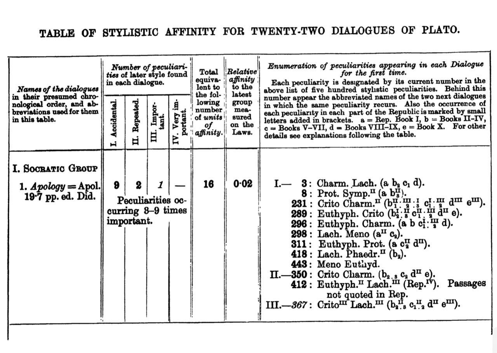

---
## 3. Г. Леджер и многомерный анализ

> Предположим, например, что мы хотим идентифицировать различные деревья… Первым требованием будет сбор информации в виде измерений различных доступных функций для каждого дерева… Мы могли бы измерять такие параметры, как вес семени, объем семени, плотность сердцевины, плотность коры, твердость коры, вес листа, количество листовых устьиц на единицу площади и так далее (Re-counting Plato, 1989)

<center>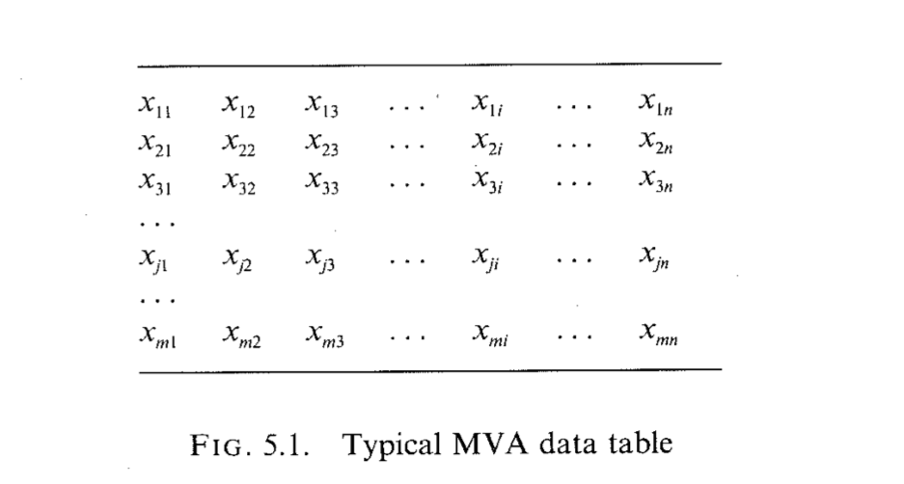

---
## 3. Текст как вектор

Текст или группа текстов могут быть представлены в виде вектора — упорядоченного множества значений, которые называются координатами или компонентами вектора. Для каждой пары векторов может быть вычислено расстояние или сходство между ними; минимальное расстояние или максимальное сходство будут указывать на возможного автора, жанровую близость и т.п.

<center>

---
## 4. Автоматическая классификация текстов


<center>


---
## 4. Точность классификации

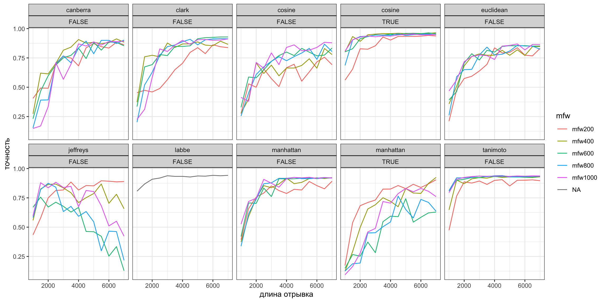

---

## 4. Вюрцбургская Дельта и Платон

```{r include=FALSE, eval=FALSE}
# corpus_all <- load.corpus.and.parse(files = "all", corpus.dir = "corpus_all", markup.type= "plain", corpus.lang = "Other", sampling = "no.sampling", preserve.case = FALSE, encoding = "UTF-8") 
# mfw <- make.frequency.list(corpus_all)[1:400]
# freq <- as.data.frame.matrix(as.table(make.table.of.frequencies(corpus_all, mfw, absent.sensitive = FALSE)))
# d1 <- dist.delta(freq)
# hc <- hclust(d1)
# colors = brewer.paired(20)
# clus20 = cutree(hc, 20)
# par(mar = c(0,0,0,0))
# plot(as.phylo(hc), type = "fan", tip.color = colors[clus20])
```

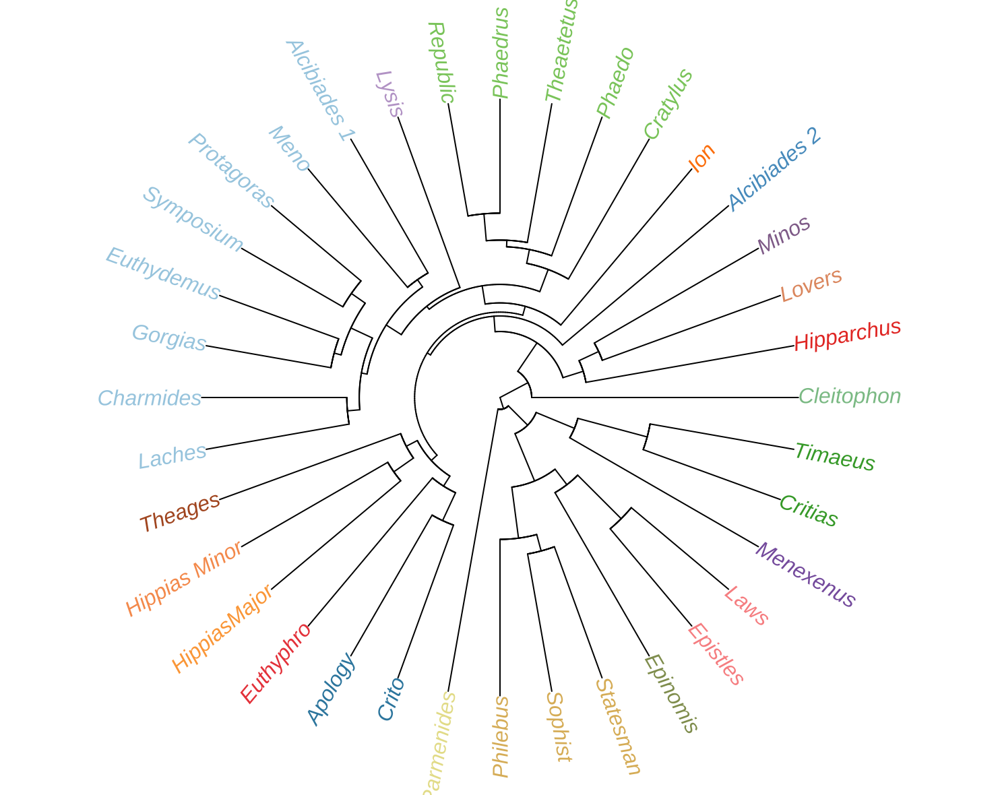

---

# 4. Вюрцбургская Дельта и Платон (2)

```{r include=FALSE}
# corpus_all <- load.corpus.and.parse(files = "all", corpus.dir = "Diorisis_Plato_Lemma", markup.type= "plain", corpus.lang = "Other", sampling = "no.sampling", preserve.case = FALSE, encoding = "UTF-8") 
# mfw <- make.frequency.list(corpus_all)[1:400]
# freq <- as.data.frame.matrix(as.table(make.table.of.frequencies(corpus_all, mfw, absent.sensitive = FALSE)))
# d1 <- dist.delta(freq)
# hc <- hclust(d1)
# colors = brewer.paired(20)
# clus20 = cutree(hc, 20)
# par(mar = c(0,0,0,0))
# plot(as.phylo(hc), type = "fan", tip.color = colors[clus20])
```

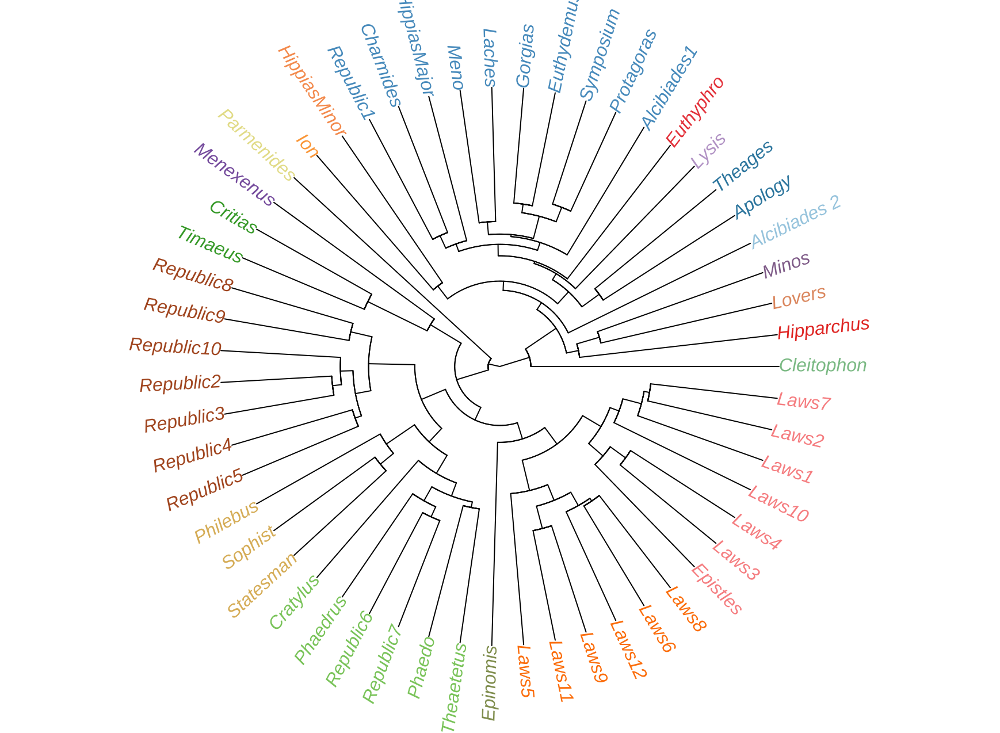

---
# 5. Векторная семантика
> You shall know a word by the company it keeps (Firth 1957)
 
- Мы можем сохранить в виде вектра числе сведения о том, с какими словами соседствует некое слово.

- Скользящее окно фиксированной ширины.

- Как правило, для этого исполььзуется такой показатель, как точечная взаимная информация (PMI).


<center>


---
# 5. PMI для Corpus Platonicum

```{r echo=FALSE, include=FALSE}
# #load corpus
# corpus <- load.corpus.and.parse(corpus.dir = "Diorisis_Plato_lemma")
# corpus <- as_tibble(stack(corpus)) %>% 
#   relocate(values, .after = ind) %>% 
#   rename(word = values, title = ind)
# 
# # select most common words
# corpus <- corpus %>% 
#   add_count(word) %>% 
#   filter(n > 20) %>% 
#   select(-n)
# 
# # delete stopwords
# stop = stopwords("grc", source = "ancient")
# stop_tbl <- as_tibble(stop) %>% mutate(word = value)
# corpus <- corpus %>% anti_join(stop_tbl, by = "word") %>% filter(word != "null")
# 
# # nest words
# corpus_nest <- corpus %>% nest(words = c(word))
# 
# # slide window function 
# slide_windows <- function(tbl, window_size) {
#   skipgrams <- slider::slide(tbl, 
#                              ~.x, 
#                              .after = window_size - 1, 
#                              .step = 1, 
#                              .complete = TRUE)
#   
#   
#   safe_mutate <- safely(mutate)
#   
#   out <- map2(skipgrams, 1:length(skipgrams), 
#               ~ safe_mutate(.x, window_id = .y))
# 
#   out %>% transpose() %>% pluck("result") %>% compact() %>% bind_rows()
# }
# 
# # tidy pmi
# plan(multisession)
# tidy_pmi <- corpus_nest %>% 
#   mutate(words = future_map(words, slide_windows, 4L)) %>% 
#   unnest(words) %>% unite(window_id, title, window_id) %>% 
#   pairwise_pmi(word, window_id)
# 
# save(tidy_pmi, file = "TidyPMI.Rdata")
```

```{r echo=FALSE}
load("data/TidyPMI.Rdata")
tidy_pmi %>% filter(item1 == "γῆ") %>% arrange(desc(pmi))
```

---

# 5. PMI матрица: снижение размерности

```{r echo=FALSE}
tidy_word_vectors <- tidy_pmi %>% widely_svd(item1, item2, pmi,
                                             nv = 50, maxit = 1000)

tidy_word_vectors %>% 
  filter(dimension <= 8) %>%
  group_by(dimension) %>% 
  top_n(10, abs(value)) %>% 
  ungroup() %>% 
  mutate(item1 = reorder_within(item1, value, dimension)) %>% 
  ggplot(aes(item1, value, fill = as.factor(dimension))) +
  geom_col(alpha = 0.8,  show.legend = F) +
  facet_wrap(~dimension, scales = "free_y", ncol = 4) +
  scale_x_reordered() +
  coord_flip() +
  labs(
    x = NULL, 
    y = "Значение",
    title = "Первые 8 главных компонент для Corpus Platonicum",
    subtitle = "Топ-10 слов в компонентах, объясняющих большую часть дисперсии") +
  theme_xaringan(
    text_font_size = 10,
    title_font_size = 16,
    text_color = "#23395b",
    background_color = "#FFFFFF",
    
                 )
```

---
# 5. Векторное представление слов

```{r echo=FALSE}
vec_cast <- tidy_word_vectors %>% dcast(item1 ~ dimension, value.var = "value")
vec_cast_df <- vec_cast %>% as.data.frame(row.names = vec_cast$item1)
vec_cast_df <- vec_cast_df[,-1]
DT::datatable(vec_cast_df[,1:4], fillContainer = FALSE, options = list(pageLength = 6))
```

---

# 5. Поиск соседей: два примера

```{r echo=FALSE, message=FALSE, warning=FALSE}
# words_cos <- philentropy::distance(vec_cast_df, method = "cosine", use.row.names = T)
# stoicheion <- words_cos["στοιχεῖον", ] %>% enframe() %>% arrange(desc(value))
# save(stoicheion, file = "Stoicheion.Rdata")
# arithmos <- words_cos["ἀριθμός", ] %>% enframe() %>% arrange(desc(value))
# save(stoicheion, file = "Stoicheion.Rdata")
# save(arithmos, file = "Arithmos.Rdata")
```

```{r echo=FALSE}
load("data/Stoicheion.Rdata")
load("data/Arithmos.Rdata")
knitr::kable(list(stoicheion[1:10,], arithmos[1:10,]), format = 'html')
```

---

# 5. Примеры исследований

Rodda M., Lenci A., Senaldi M.S. Panta rei: Tracking semantic change with Distributional Semantics in Ancient Greek // _Italian Journal of Computational Linguistics_. Vol. 3. No. 1. 2017. P. 11-24.


<center>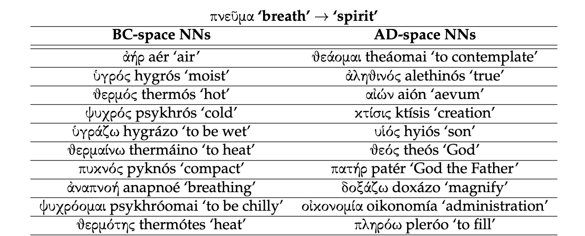

---

# 6. Тематическое моделирование

- каждый документ представляет собой набор тем; каждая тема представляет собой набор слов;

- на основе распределения Дирихле *alpha* выбирается наиболее вероятное распределение тем в документе — *theta*; на основе распределения тем θ выбирается уже конкретная тема *Z*;

- на основе другого распределения Дирихле — *beta* — выбирается самое вероятное распределение слов в теме Z, это распределение слов называется *phi*; из φ выбирается слово *W*;

- M — количество документов в корпусе; N — количество слов в документе.

<center>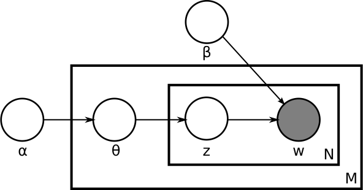

---

# 6. Темы и слова

```{r echo=FALSE, include=FALSE}
# corpus <- load.corpus.and.parse(corpus.dir = "Diorisis_Plato_lemma")
# corpus <- as_tibble(stack(corpus)) %>% 
#   relocate(values, .after = ind) %>%
#   rename(word = values, title = ind)
# 
# # delete stopwords
# stop = stopwords::stopwords("grc", source = "ancient")
# stop_tbl <- as_tibble(stop) %>% mutate(word = value)
# corpus <- corpus %>% anti_join(stop_tbl, by = "word") %>% filter(word != "null")
# 
# corpus_dtm <- corpus %>% 
#   add_count(title, word) %>% 
#   cast_dtm(title, word, n)
# 
# my_lda <- LDA(corpus_dtm, k = 10, control = list(seed = 1234), method = "Gibbs")
# save(my_lda, file = "LDA.Rdata")
```

```{r echo = F}
load("data/LDA.Rdata")
pl_topics <- tidy(my_lda, matrix = "beta")

pl_top_terms <- pl_topics %>% 
  group_by(topic) %>% 
  top_n(10, beta) %>% 
  arrange(topic, -beta) %>% 
  slice_head(n = 10) %>% 
  ungroup()

pl_top_terms %>% 
  mutate(term = reorder(term, beta)) %>% 
  ggplot(aes(term, beta, fill = factor(topic))) + 
  geom_col(show.legend = FALSE) +
  facet_wrap(~ topic, scales = "free", nrow = 2) +
  coord_flip() + 
  theme_xaringan(
    text_font_size = 10,
    title_font_size = 16,
    text_color = "#23395b",
    background_color = "#FFFFFF",
  )
```

---

## 6. Какие темы связаны с "Тимеем"?

```{r echo=FALSE}
pl_docs <- tidy(my_lda, matrix = "gamma")
# pl_docs %>% group_by(document) %>% summarise(sum = sum(gamma))
pl_docs %>% 
  filter(document == "Timaeus") %>%
  arrange(desc(gamma))
```

---

# Документы и темы

```{r echo=FALSE}
pl_docs %>% 
  filter(document %in% c("Apology", "Crito", "Philebus", "Statesman")) %>% 
  mutate(document = reorder(document, gamma)) %>%
  ggplot(aes(factor(topic), gamma, color = document)) +
  geom_boxplot(show.legend = F) +
  facet_wrap(~ document)
  
```


---

# LDA для автоматической детекции философии в корпусе 

Koentges Th. _Measuring Philosophy in the First Thousand Years of Greek Literature_ // Digital Classics Online Vol. 6. No. 2. 2020.

.pull-left[
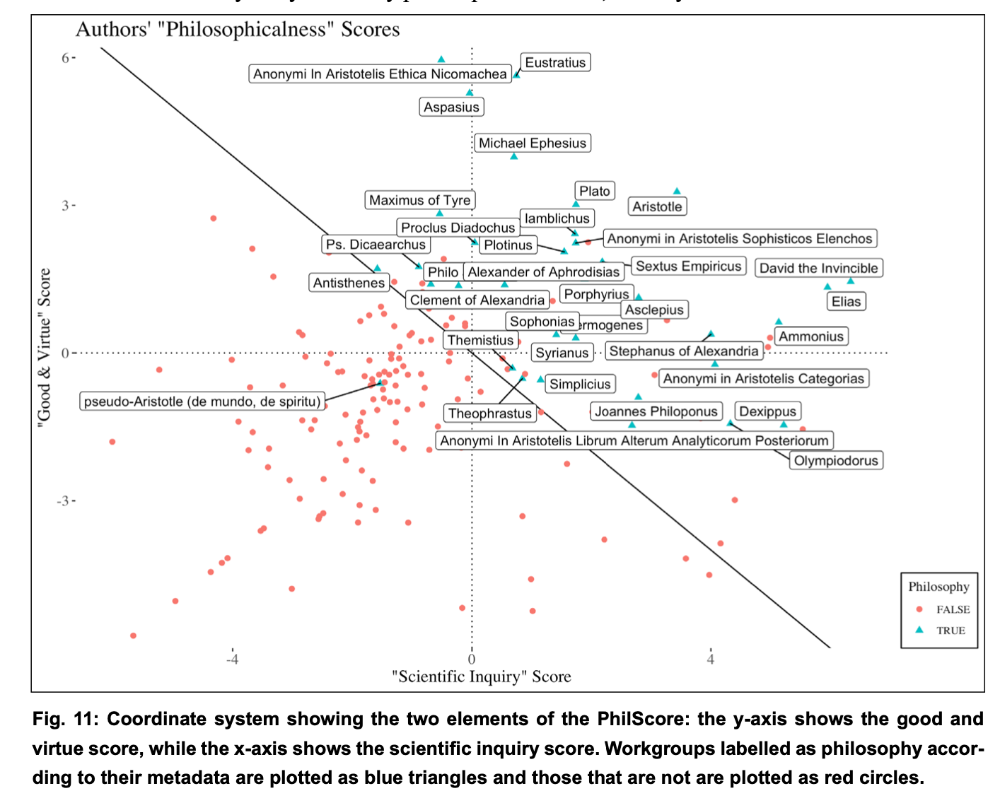
]

.pull-right[
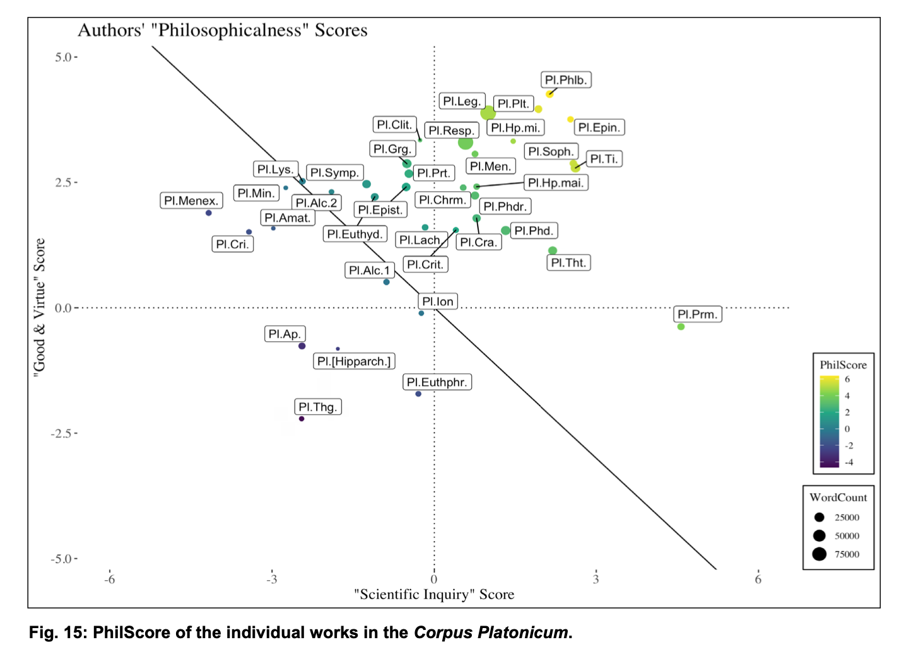
]

---
class: center, middle

# Спасибо за внимание!

Slides created via the R packages:

[**xaringan**](https://github.com/yihui/xaringan)<br>
[gadenbuie/xaringanthemer](https://github.com/gadenbuie/xaringanthemer)

The chakra comes from [remark.js](https://remarkjs.com), [**knitr**](http://yihui.name/knitr), and [R Markdown](https://rmarkdown.rstudio.com).
